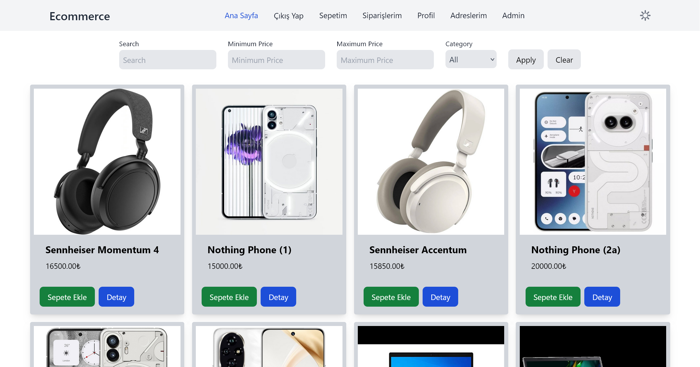
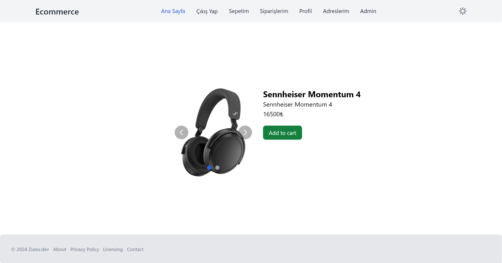
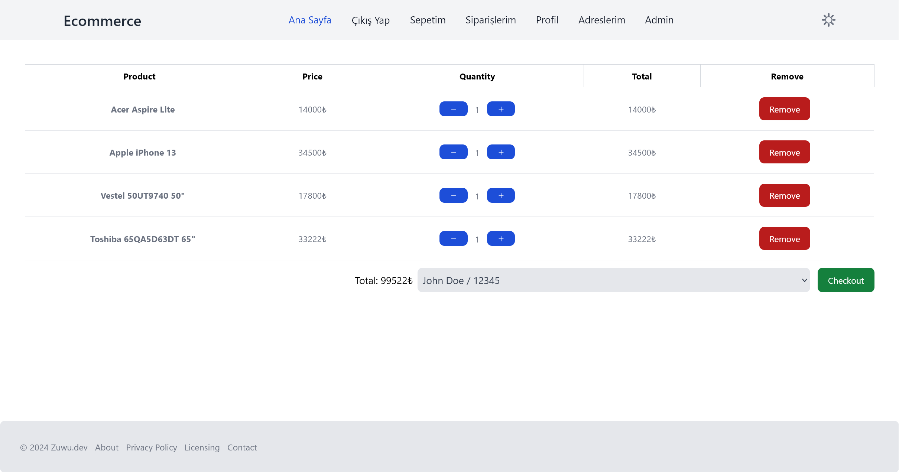
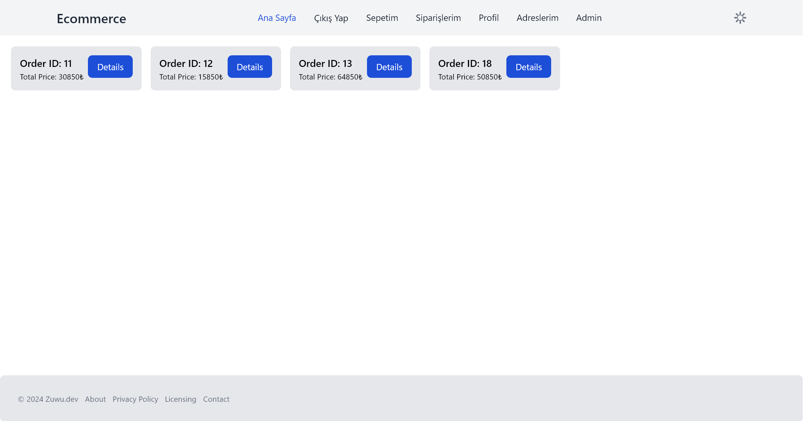
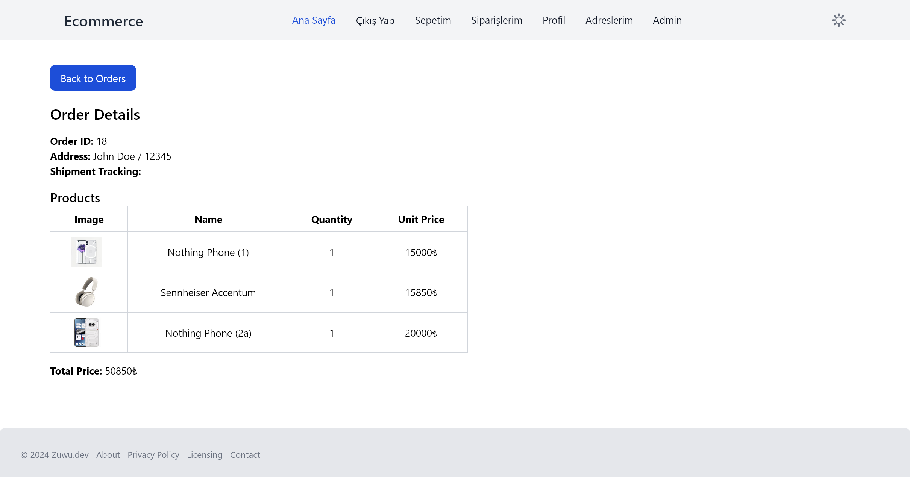
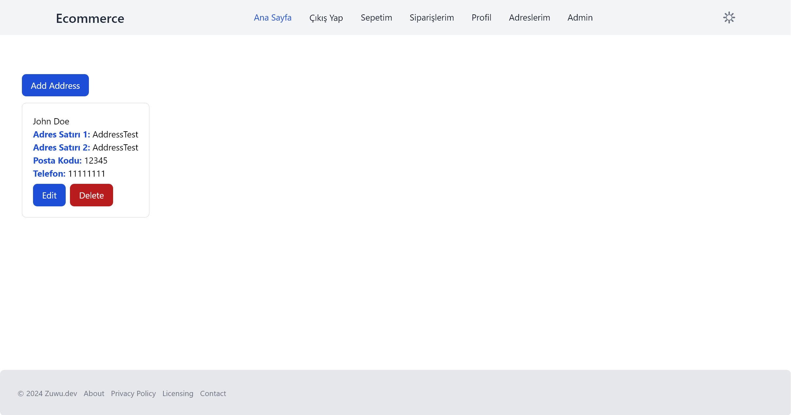
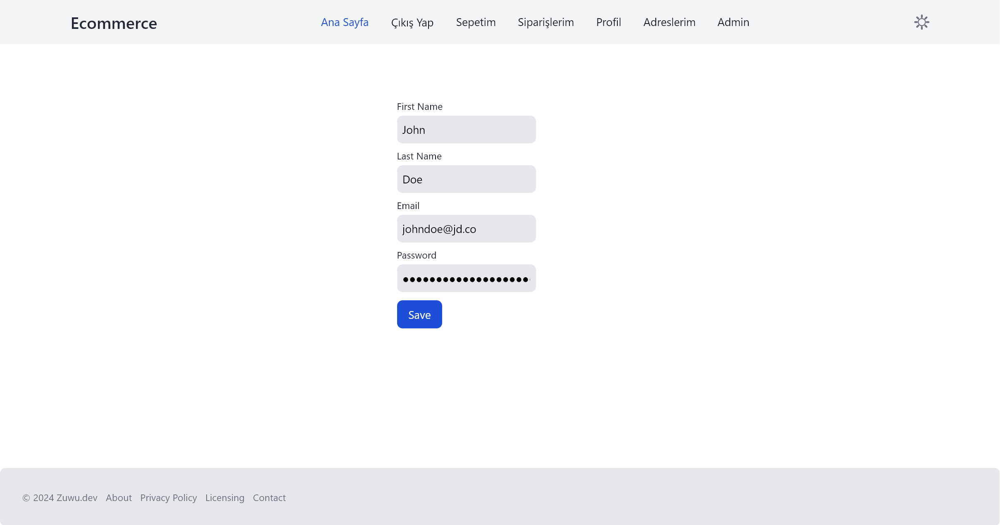
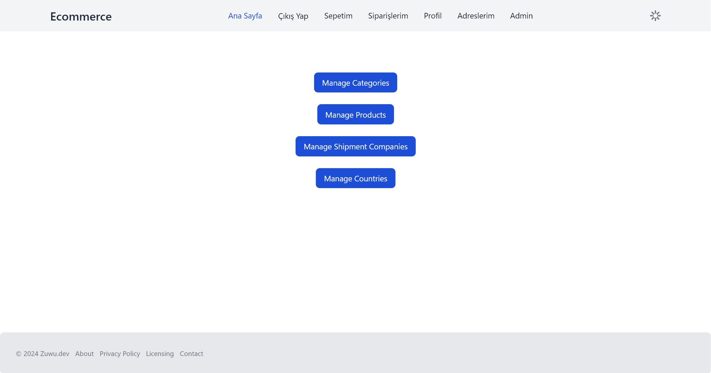
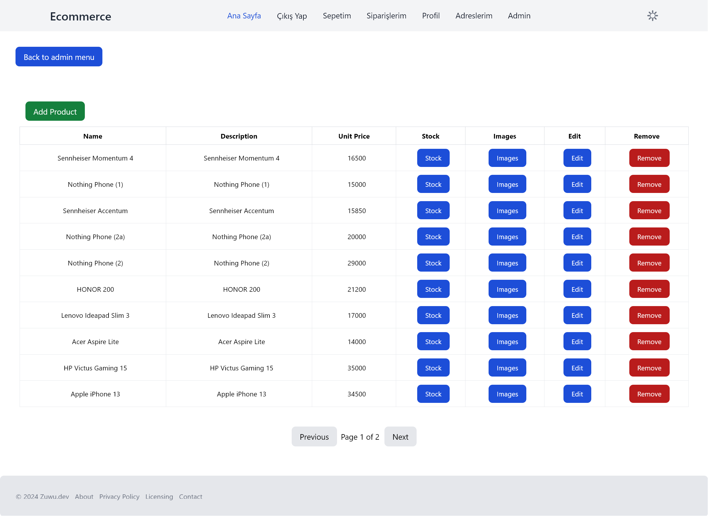

# E-commerce Frontend

For Backend [Click Here](https://github.com/Kuuw/ecommerceAPI)

## Technologies and Libraries

- **React**
- **TypeScript**
- **React Router DOM**
- **Axios**
- **Tailwind CSS**
- **Vite**

## Screenshots



















## Running the Project

To run the project locally, follow these steps:

1. **Clone the repository:**
   ```sh
   git clone https://github.com/Kuuw/ecommerceFE.git
   cd ecommerceFE
   ```

2. **Install dependencies:**
   ```sh
   npm install
   ```

3. **Start the development server:**
   ```sh
   npm run dev
   ```

## License

This project is licensed under the MIT License.